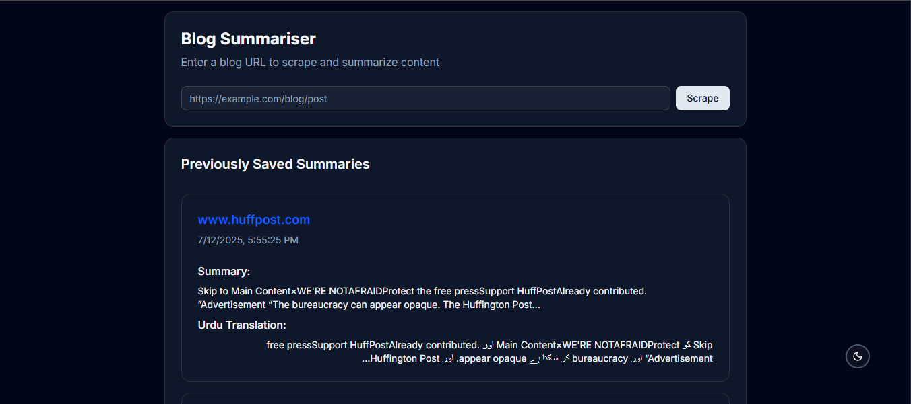

# Blog Summarizer

  
**

## 📝 Description
A Next.js application that:
1. Scrapes blog content from any URL
2. Generates AI-powered summaries (simulated)
3. Translates summaries to Urdu
4. Stores summaries in Supabase and full text in MongoDB

## 🎥 Demo Video
Watch the walkthrough: [Assignment-2 Demo Video](/public/Assignment-2%20demo.mp4)

## 🔗 Live Demo
[](https://nexium-hamza-zahoor-assign2.vercel.app/)

## 🌟 Features
- URL-based content scraping
- AI-generated summaries (mock logic)
- Urdu translation using JS dictionaries
- Dual database storage:
  - Summaries in Supabase
  - Full content in MongoDB
- Responsive ShadCN UI components

## 🛠️ Tech Stack
- **Framework**: Next.js 15
- **UI**: ShadCN Components
- **Database**: 
  - Supabase (PostgreSQL)
  - MongoDB Atlas
- **Scraping**: Custom API routes
- **Deployment**: Vercel

## 🚀 Getting Started

### Prerequisites
- Node.js ≥18.x
- PNPM (recommended)
- MongoDB Atlas account
- Supabase account

### Installation
```bash
# Clone the repository
git clone https://github.com/Hamza-Zahoor157/Nexium_Hamza_Zahoor_Assign2.git

# Navigate to project
cd Nexium_Hamza_Zahoor_Assign2/internship/assignment-2

# Install dependencies
pnpm install
